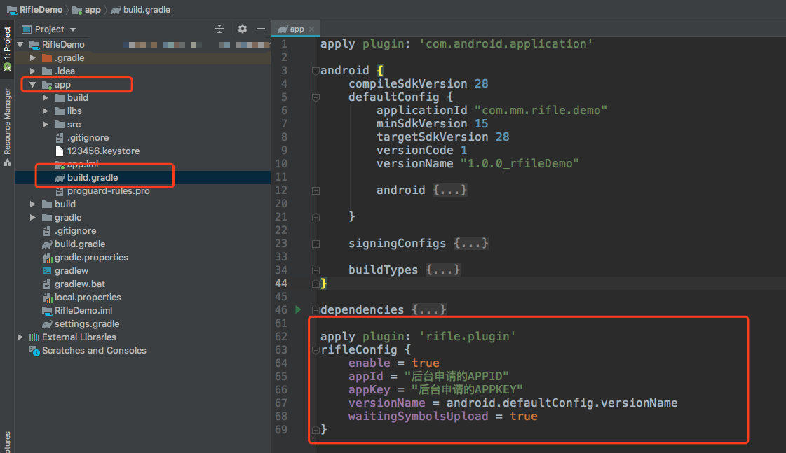
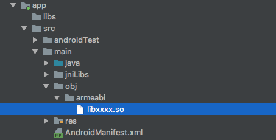

# Android SDK 使用指南

---

## 通过Gradle集成

### 添加仓库地址
Rifle支持[JCenter仓库](http://jcenter.bintray.com/com/cosmos/rifle/)

目前，Rifle支持Java和Native两种Crash收集，为了减少SDK对包大小的占用，分成两个库。

如果只收集`Java Crash`，引入SDK即可：

- com.cosmos.rifle:core

如果需要收集`Native Crash` 则还需要引入NDK（so库）：

- com.cosmos.rifle:native

> 引入NDK，必须先引入SDK

### 只集成SDK
在Module的build.gradle文件中添加依赖和属性配置：

```
dependencies {
    compile 'com.cosmos.rifle:core:1.8.3'
}
```

### 集成SDK以及NDK
在Module的build.gradle文件中添加依赖和属性配置：

```
dependencies {
    compile 'com.cosmos.rifle:core:1.8.3'
    compile 'com.cosmos.rifle:native:1.1.3'     // 收集native crash需要用到的NDK
}
```

**NDK中有多个架构的SO库，有必要在gradle中配置自身应用需要的SO库，减少包大小占用**

```
android {
    defaultConfig {
        ndk {
            // 设置支持的SO库架构
            abiFilters 'armeabi' //, 'x86', 'armeabi-v7a', 'x86_64', 'arm64-v8a'
        }
    }
}
```

#### 集成NDK时可能碰到的情况
- **情况一：**
如果在添加“abiFilter”之后Android Studio出现以下提示：

`NDK integration is deprecated in the current plugin.  Consider trying the new experimental plugin.`

**解决：**在项目根目录的gradle.properties文件中添加：

`android.useDeprecatedNdk=true`

- **情况二：**
如果在集成NDK后，编译时出现如下错误信息：

`More than one file was found with OS independent path 'lib/armeabi-v7a/libc++_shared.so'`

**解决**
则对NDK的依赖方式改成如下格式：

```
implementation ('com.cosmos.rifle:native:1.1.3') {
    exclude group: 'com.cosmos.baseutil', module: 'cpp_shared'
}
```

## 混淆解析以及符号文件
如果APP有通过`proguard`进行混淆，或者项目中含有Native代码。为了方便查看后台收集到的堆栈信息，需要配置插件来提交`mapping`文件以及带带符号表的SO文件。插件将会在打Release包的时候（assembleRelease任务执行时）提交mapping文件以及带符号表SO文件

### 混淆设置
为避免混淆Rifle，在Proguard混淆文件中增加以下配置：

```
-dontwarn com.mm.rifle.**
-keep class com.mm.rifle.**{*;}
```

### 添加插件依赖
在Project的build.gradle下面添加编译期依赖：

```
buildscript {
    dependencies {
        classpath 'com.cosmos.rifle:plugin:1.4.1'
    }
}
```


### 应用插件
在Module的build.gradle文件中应用插件：

```
apply plugin: 'rifle.plugin'
rifleConfig {
    appId = "4af037b83e77345j3443io5d8d67395"          // 管理后台申请的应用APPID
    appKey = "e843359357823432hkj37b715e68cf6"         // 管理后台申请的应用APPKEY
    versionName = android.defaultConfig.versionName     // 当前应用的版本名称
    // enable = true                      // 打开/关闭插件（默认为true）
    // symbolsDir = "src/main/obj"        // 带符号表SO文件所在目录（默认为"src/main/obj"）
    // enableSymbolsUpload = true         // 打开/关闭提交带符号表SO的功能（默认为true）
    // waitingSymbolsUpload = true      // 打包完成后需要确认符号表文件是否提交完成，未完成需要等待提交完成。默认true
}
```



带符号表的so文件，需要放在Module下的`src/main/obj`下，对应架构放在对应架构目录下，当然，开发者可以通过上面的`symbolsDir`属性来修改此路径，默认放置如下：


### 使用上传符号so脚本

如果SO更新比较频繁，为了减少开发者不断更新`src/main/obj`的工作量，**强烈建议**在编译发布新版本SO库的流程中，执行下面的脚本，将编译好的**带符号表SO**直接提交到后台：

[提交带符号表SO的脚本](./geng-xin-ri-zhi/ti-jiao-dai-fu-hao-biao-so-jiao-ben-geng-xin-ri-zhi.md)

脚本需要传入参数：

- -f : 带符号表so文件路径
- -i : 应用程序的appId
- -k : 应用程序的appKey

一个栗子：

```
./uploadSymbols.sh -f ./libdemo.so -i 后台申请的APPID -k 后台申请的APPKEY
```

> 注意： 这里的带符号表libdemo.so文件名称需要保持与APK中不带符号表的so名称保持一直

## 参数配置

- 在AndroidManifest.xml中添加权限：

```
<uses-permission android:name="android.permission.READ_PHONE_STATE" />
<uses-permission android:name="android.permission.INTERNET" />
<uses-permission android:name="android.permission.ACCESS_NETWORK_STATE" />
<uses-permission android:name="android.permission.ACCESS_WIFI_STATE" />
```

> 注：如果您的App需要上传到`google play store`，您需要将`READ_PHONE_STATE`权限屏蔽掉或者移除，否则可能会被下架。

## 初始化Rifle

在Application的onCreate方法中，加入如下代码初始化Rifle，尽量放在onCreate方法靠前些位置，防止漏掉初始化Rifle之前发生的崩溃。

```
Rifle.init(context, "后台申请的APPID", false);
```

> `为了防止后台部分数据不准确，不建议在异步线程初始化Rifle`

第三个参数为调试模式开关，开发阶段可以将改值改成`true`，调试模式特征：
- 输出所有Rifle的日志

## 测试
通过调用如下方法，可以触发一个Java/Native崩溃（建议通过“按钮”点击事件调用）

```
Rifle.testJavaCrash();      // 触发一个Java层的Crash
Rifle.testNativeCrash();    // 触发一个Native层的Crash
```

## 高级功能
如果你需要输出用户自定义日志、更灵活的配置Crash提交的时机、提交的进程等功能，请参阅[高级功能](./gao-ji-gong-neng.md)


